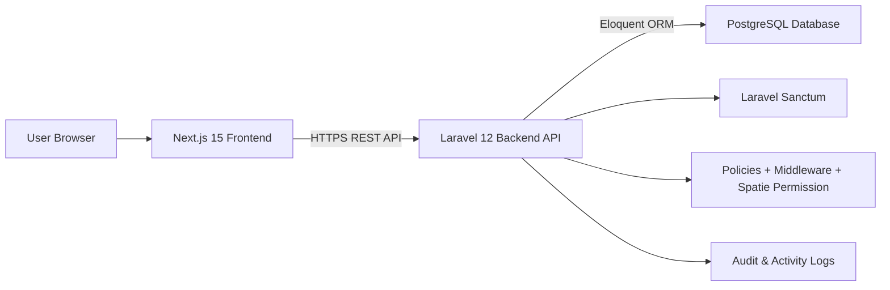
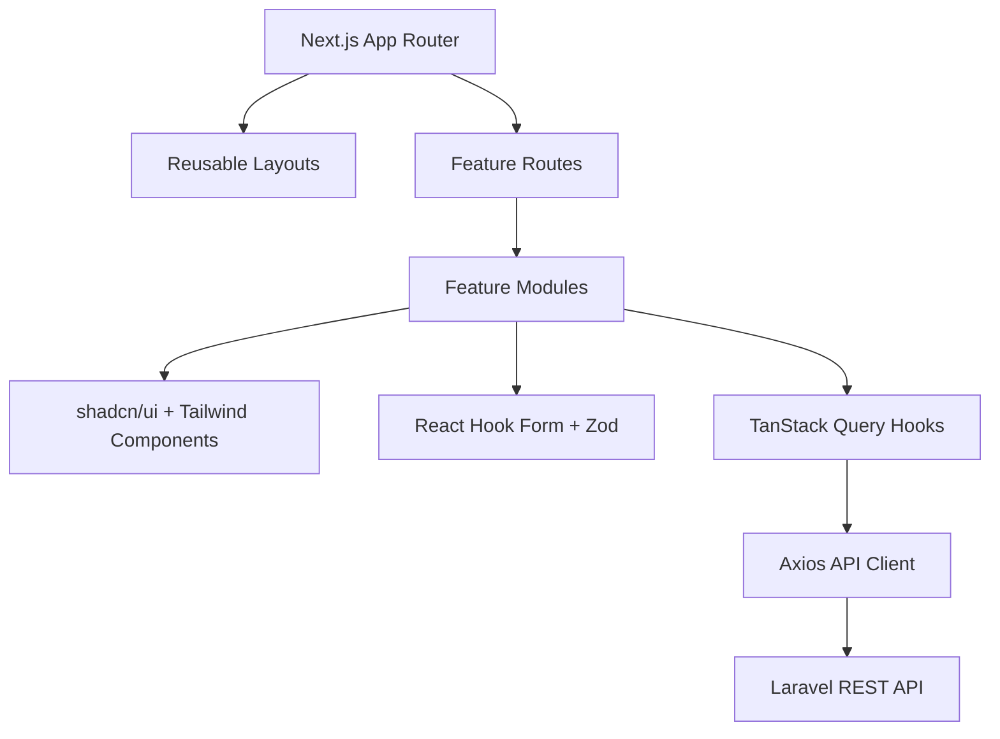
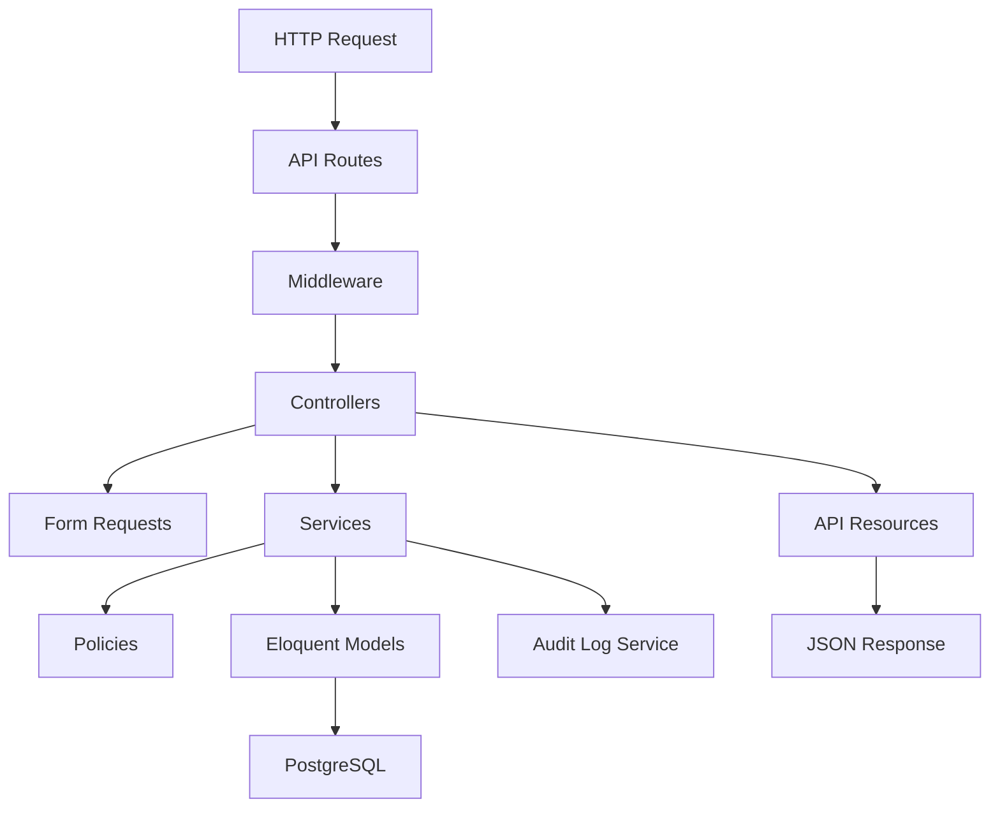
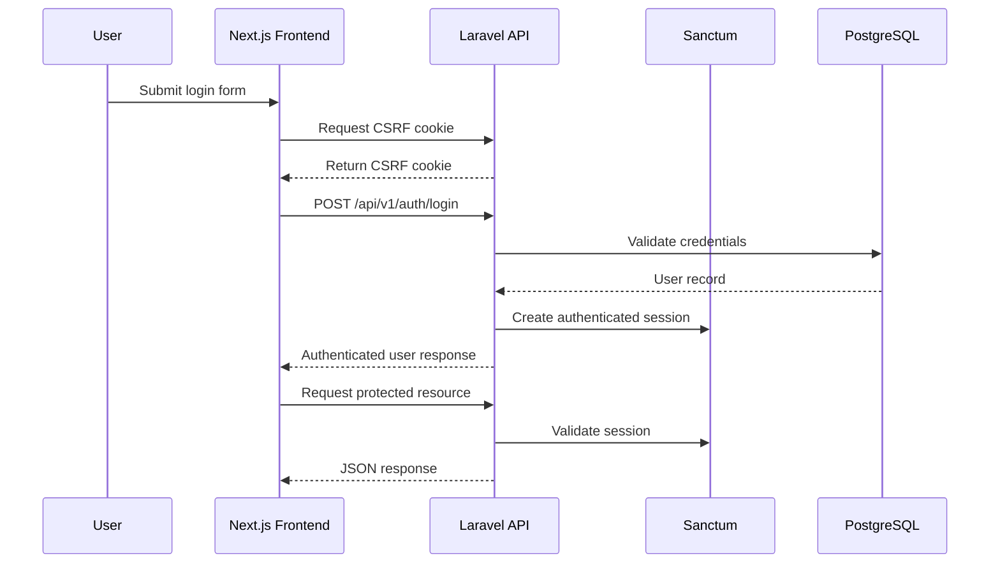
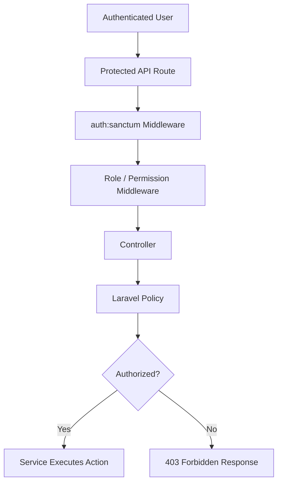
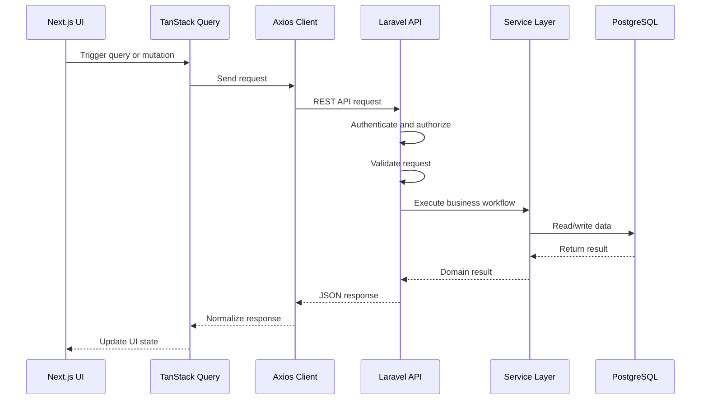
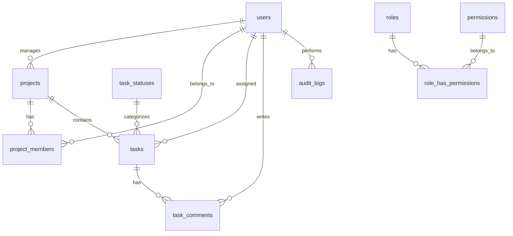

# Project and Team Task Management Platform


> A production-style project and team task management platform built with a decoupled **Next.js 15 frontend** and **Laravel 12 REST API backend**.

This project demonstrates clean full-stack architecture, secure authentication, scalable role-based authorization, normalized PostgreSQL database design, reusable UI patterns, professional API standards, and deployment-ready engineering practices.

---

## Table of Contents

- [Overview](#overview)
- [Key Features](#key-features)
- [User Roles](#user-roles)
- [Technology Stack](#technology-stack)
- [System Architecture](#system-architecture)
- [Architecture Diagrams](#architecture-diagrams)
- [Database Architecture](#database-architecture)
- [Folder Structure](#folder-structure)
- [Project Modules](#project-modules)
- [Security Features](#security-features)
- [Design Principles](#design-principles)
- [Development Phases](#development-phases)
- [Installation](#installation)
- [Environment Variables](#environment-variables)
- [Running Locally](#running-locally)
- [API Documentation](#api-documentation)
- [Screenshots](#screenshots)
- [Future Improvements](#future-improvements)
- [Contributing](#contributing)
- [License](#license)
- [Author](#author)

---

## Overview

The **Project and Team Task Management Platform** helps administrators, project managers, and team members manage projects, users, teams, tasks, task comments, reports, dashboards, roles, permissions, and audit history.

The system is intentionally split into two independent applications:

```txt
project-root/
  frontend/   Next.js 15 application
  backend/    Laravel 12 REST API
```

The frontend communicates with the backend only through versioned REST APIs. The backend owns authentication, authorization, validation, business rules, persistence, and audit logging.

---

## Key Features

| Area | Features |
|---|---|
| Authentication | Login, logout, authenticated user profile, protected API routes |
| Authorization | Role-based access control, permission checks, policies, middleware |
| User Management | User CRUD, activation status, soft delete, restore, role assignment |
| Role Management | Roles, permissions, role-permission assignment |
| Project Management | Project CRUD, project manager assignment, member assignment |
| Task Management | Task CRUD, assignment, statuses, priorities, progress tracking |
| Comments | Task comments with ownership and authorization rules |
| Dashboards | Role-specific dashboard summaries |
| Reports | Project progress, task completion, workload, status summaries |
| Audit Logs | Audit and activity tracking for important system actions |
| API Quality | Consistent JSON responses, validation errors, pagination, filtering |
| Frontend UX | Responsive UI, reusable components, form validation, protected routes |

---

## User Roles

### Administrator

Administrators manage the entire system.

- Manage users, roles, and permissions
- Manage all projects
- Assign project managers
- View system dashboard and reports
- Review audit and activity logs
- Restore or permanently delete supported records where appropriate

### Project Manager

Project managers manage projects they own or are assigned to manage.

- Create and update managed projects
- Assign team members
- Create and assign tasks
- Update task details and statuses
- View project reports and activity

### Team Member

Team members work on assigned projects and tasks.

- View assigned projects
- View assigned tasks
- Update task progress
- Comment on authorized tasks
- View personal dashboard

---

## Technology Stack

### Frontend

| Technology | Purpose |
|---|---|
| Next.js 15 | React framework with App Router |
| TypeScript | Static typing and safer frontend code |
| Tailwind CSS | Utility-first styling |
| shadcn/ui | Accessible reusable UI components |
| TanStack Query | Server state, caching, mutations, refetching |
| Axios | HTTP client for REST API communication |
| React Hook Form | Form state management |
| Zod | Schema-based frontend validation |

### Backend

| Technology | Purpose |
|---|---|
| Laravel 12 | REST API backend framework |
| PHP 8.4 | Backend runtime |
| Laravel Sanctum | SPA/API authentication |
| Laravel Policies | Model-level authorization |
| Laravel Middleware | Route-level protection |
| Spatie Laravel Permission | Roles and permissions |
| Eloquent ORM | Database relationships and persistence |
| Laravel Pint | PHP code formatting |

### Database and Deployment

| Technology | Purpose |
|---|---|
| PostgreSQL | Relational database |
| Vercel | Frontend deployment |
| Render | Backend API deployment |
| GitHub Actions | CI/CD workflow |

---

## System Architecture

The platform follows a decoupled client-server architecture:

- The **Next.js frontend** handles UI, routing, forms, and server-state management.
- The **Laravel backend** exposes REST APIs and owns business logic.
- The **PostgreSQL database** is private and accessed only by the backend.
- Authentication is handled with **Laravel Sanctum**.
- Authorization is enforced using **middleware, policies, and Spatie Permission**.

---

## Architecture Diagrams

### High-Level Architecture



### Frontend Architecture



### Backend Architecture



### Authentication Flow



### Authorization Flow



### API Request/Response Flow



---

## Database Architecture

The database is designed for PostgreSQL and follows normalized relational design principles.

Core data areas:

- Users
- Roles
- Permissions
- Projects
- Project Members
- Tasks
- Task Statuses
- Task Comments
- Audit and Activity Logs

### Database Design Summary

| Table | Purpose |
|---|---|
| `users` | Stores system users |
| `roles` | Stores Spatie roles |
| `permissions` | Stores Spatie permissions |
| `projects` | Stores project records |
| `project_members` | Many-to-many relationship between projects and users |
| `tasks` | Stores project tasks |
| `task_statuses` | Normalized task workflow statuses |
| `task_comments` | Stores task discussion comments |
| `audit_logs` | Stores audit and activity history |

### Relationship Overview



---

## Folder Structure

<details>
<summary><strong>Frontend Structure</strong></summary>

```txt
frontend/
  app/
    (auth)/
      login/
        page.tsx
    (dashboard)/
      dashboard/
        page.tsx
      projects/
        page.tsx
        [id]/
          page.tsx
      tasks/
        page.tsx
      users/
        page.tsx
      roles/
        page.tsx
      reports/
        page.tsx
    layout.tsx
    page.tsx

  components/
    ui/
    layout/
    common/
    forms/
    tables/

  features/
    auth/
    users/
    roles/
    projects/
    tasks/
    comments/
    dashboard/
    reports/

  lib/
    api-client.ts
    query-client.ts
    auth.ts
    permissions.ts
    utils.ts

  providers/
    query-provider.tsx
    auth-provider.tsx

  types/
    api.ts
    user.ts

  middleware.ts
```

</details>

<details>
<summary><strong>Backend Structure</strong></summary>

```txt
backend/
  app/
    Http/
      Controllers/
        Api/
          V1/
      Requests/
      Resources/
      Middleware/

    Models/
    Policies/
    Services/
    Repositories/
    Support/

  database/
    migrations/
    seeders/
    factories/

  routes/
    api.php
```

</details>

---

## Project Modules

| Module | Description |
|---|---|
| Authentication | Login, logout, current user, protected sessions |
| Users | User management, activation, roles |
| Roles & Permissions | Scalable access management |
| Projects | Project CRUD, ownership, manager assignment |
| Project Members | Team assignment and membership rules |
| Tasks | Task CRUD, assignment, priority, progress |
| Task Statuses | Normalized task workflow statuses |
| Comments | Task discussion and collaboration |
| Dashboard | Role-specific dashboard metrics |
| Reports | Project, workload, and completion summaries |
| Audit Logs | Administrative audit and activity tracking |

---

## Security Features

- Laravel Sanctum authentication
- HTTP-only cookie-based SPA authentication where applicable
- CSRF protection
- Strict CORS configuration
- Role-based access control
- Permission-based route protection
- Laravel Policies for model-level authorization
- Server-side validation with Form Requests
- Password hashing
- API Resources to prevent sensitive data exposure
- Audit logging for sensitive actions
- Environment-based secrets
- Consistent `401`, `403`, and validation error responses

---

## Design Principles

- **Separation of concerns** between frontend, backend, and database
- **Thin controllers** with business logic in services
- **Policy-based authorization** for resource-specific access control
- **Feature-based frontend organization**
- **Consistent API contracts**
- **Normalized database design**
- **Secure by default**
- **Scalable role and permission management**
- **Maintainable code over shortcuts**
- **Testing-ready architecture**

---

## Development Phases

| Phase | Description | Status |
|---|---|---|
| Phase 1 | Requirement Analysis | Completed |
| Phase 2 | System Design | Completed |
| Phase 3 | Database Design | Completed |
| Phase 4 | Laravel Backend | Planned |
| Phase 5 | Next.js Frontend | Planned |
| Phase 6 | Integration | Planned |
| Phase 7 | Testing | Planned |
| Phase 8 | Deployment | Planned |
| Phase 9 | Documentation | In Progress |

---

## Installation

> These commands assume the repository contains separate `frontend/` and `backend/` applications.

### Backend Setup

```bash
cd backend
composer install
cp .env.example .env
php artisan key:generate
php artisan migrate --seed
php artisan serve
```

### Frontend Setup

```bash
cd frontend
npm install
cp .env.example .env.local
npm run dev
```

---

## Environment Variables

### Backend `.env`

```env
APP_NAME="Project and Team Task Management Platform"
APP_ENV=local
APP_KEY=
APP_DEBUG=true
APP_URL=http://localhost:8000
FRONTEND_URL=http://localhost:3000

DB_CONNECTION=pgsql
DB_HOST=127.0.0.1
DB_PORT=5432
DB_DATABASE=task_management
DB_USERNAME=postgres
DB_PASSWORD=password

SESSION_DRIVER=cookie
SESSION_DOMAIN=localhost
SANCTUM_STATEFUL_DOMAINS=localhost:3000
```

### Frontend `.env.local`

```env
NEXT_PUBLIC_API_URL=http://localhost:8000/api/v1
NEXT_PUBLIC_BACKEND_URL=http://localhost:8000
```

---

## Running Locally

Start the backend:

```bash
cd backend
php artisan serve
```

Start the frontend:

```bash
cd frontend
npm run dev
```

Open the application:

```txt
http://localhost:3000
```

Backend API:

```txt
http://localhost:8000/api/v1
```

---

## API Documentation

The REST API is versioned under:

```txt
/api/v1
```

### Standard Success Response

```json
{
  "success": true,
  "message": "Project retrieved successfully.",
  "data": {}
}
```

### Standard Validation Error Response

```json
{
  "success": false,
  "message": "The given data was invalid.",
  "errors": {
    "name": ["The name field is required."]
  }
}
```

### Standard Paginated Response

```json
{
  "success": true,
  "message": "Projects retrieved successfully.",
  "data": [],
  "meta": {
    "current_page": 1,
    "per_page": 15,
    "total": 120,
    "last_page": 8
  }
}
```

### Planned API Groups

| Group | Example Endpoint |
|---|---|
| Authentication | `POST /api/v1/auth/login` |
| Users | `GET /api/v1/users` |
| Roles | `GET /api/v1/roles` |
| Permissions | `GET /api/v1/permissions` |
| Projects | `GET /api/v1/projects` |
| Project Members | `POST /api/v1/projects/{project}/members` |
| Tasks | `GET /api/v1/tasks` |
| Comments | `POST /api/v1/tasks/{task}/comments` |
| Dashboard | `GET /api/v1/dashboard` |
| Reports | `GET /api/v1/reports/projects` |
| Audit Logs | `GET /api/v1/audit-logs` |

---

## Screenshots

> Screenshots will be added as the frontend is implemented.

| Dashboard | Projects |
|---|---|
|  |  |

| Tasks | Reports |
|---|---|
|  |  |

---

## Future Improvements

The current scope focuses on a complete production-quality assessment project. The architecture is designed to allow future enhancements such as:

- Notifications
- File attachments
- Multi-organization support
- Advanced reporting
- Calendar or timeline views
- Real-time updates

These are future considerations and are not required for the core implementation.

---

## Contributing

Contributions should follow the project’s architecture and coding standards.

1. Fork the repository.
2. Create a feature branch.
3. Keep commits small and descriptive.
4. Follow PSR-12 and Laravel Pint for backend code.
5. Use TypeScript conventions for frontend code.
6. Add or update tests for business-critical behavior.
7. Open a pull request with a clear description.

---

## License

This project is open-sourced under the [MIT License](LICENSE).

---

## Author

**Project and Team Task Management Platform**

Built as a production-quality full-stack software engineering project using Laravel, Next.js, PostgreSQL, and modern REST API architecture.

```txt
Author: Kisho Jeyapragash
GitHub: https://github.com/jeyapragash1
LinkedIn: https://lk.linkedin.com/in/jeya-pragash
```
