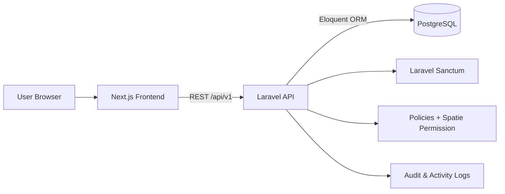

# Project and Team Task Management Platform


A production-style project and team task management platform built with a decoupled Laravel REST API and Next.js frontend. The system demonstrates authentication, role-based authorization, project management, team assignment, task tracking, comments, dashboards, reports, API documentation, and portfolio-ready repository structure.


## Table of Contents

- [Overview](#overview)
- [Features](#features)
- [Technology Stack](#technology-stack)
- [Architecture](#architecture)
- [Folder Structure](#folder-structure)
- [Installation](#installation)
- [Environment Variables](#environment-variables)
- [Backend Setup](#backend-setup)
- [Frontend Setup](#frontend-setup)
- [Running the Project](#running-the-project)
- [Running Tests](#running-tests)
- [API Documentation](#api-documentation)
- [Default Administrator Account](#default-administrator-account)
- [Screenshots](#screenshots)
- [Future Improvements](#future-improvements)
- [License](#license)
- [Contributors](#contributors)

## Overview

The platform supports three primary user groups: Administrators, Project Managers, and Team Members. Administrators manage users, roles, permissions, and the whole system. Project Managers manage assigned projects, members, and tasks. Team Members view assigned work, update task progress, and comment on authorized tasks.

The frontend and backend are intentionally separated:

- `frontend/`: Next.js App Router application.
- `backend/`: Laravel REST API application.
- `postman/`: Importable API collection and local environment.
- `docs/`: Project documentation.
- `diagrams/`: Mermaid architecture and workflow diagrams.

## Features

| Area | Implemented Capability |
| --- | --- |
| Authentication | Login, logout, current user, profile update, password change |
| Authorization | Laravel Sanctum, Policies, Gates, Middleware, Spatie Laravel Permission |
| Users | List, view, create, update, activate/deactivate, soft delete, restore |
| Roles & Permissions | Role CRUD, permission listing, assign/remove permissions |
| Projects | List, view, create, update, archive, activate, soft delete, restore |
| Project Members | List, add, view, remove project memberships |
| Tasks | List, view, create, update, assign, status update, soft delete, restore |
| Task Comments | List, view, create, update own comment, delete own comment |
| Dashboard | Role-aware statistics, task summaries, recent activity |
| Reports | Users, projects, tasks, progress, and workload reports |
| API Standards | Consistent JSON responses, validation errors, pagination, filtering |
| UI | Responsive application shell, protected routes, dark mode, reusable components |
| Testing | Feature tests for backend modules, frontend lint/type/build verification |

## Technology Stack

| Layer | Tools |
| --- | --- |
| Frontend | Next.js 16.2.10, React 19, TypeScript, Tailwind CSS, shadcn/Base UI, TanStack Query, Axios, React Hook Form, Zod, Lucide React, Sonner |
| Backend | Laravel 12, PHP 8.4, Laravel Sanctum, Spatie Laravel Permission, Eloquent ORM, PHPUnit |
| Database | PostgreSQL |
| API | Versioned REST API under `/api/v1` |
| Tooling | Composer, npm, GitHub Actions, Postman |

## Architecture

The platform uses a decoupled client-server architecture. The frontend owns presentation, routing, forms, cache state, and protected UI flow. The backend owns authentication, authorization, validation, business workflows, persistence, and JSON API contracts.



See [docs/architecture.md](docs/architecture.md), [diagrams/README.md](diagrams/README.md), and the static [architecture image](assets/architecture.svg).

## Folder Structure

```txt
project-team-task-management-platform/
├── backend/                 # Laravel 12 REST API
├── frontend/                # Next.js frontend
├── docs/                    # Project documentation
├── diagrams/                # Mermaid diagrams
├── postman/                 # Postman collection and environment
├── assets/                  # Static README assets and screenshot placeholders
├── .github/                 # GitHub templates and workflows
├── README.md
├── CONTRIBUTING.md
├── CODE_OF_CONDUCT.md
├── SECURITY.md
└── LICENSE
```

## Installation

Prerequisites:

- PHP 8.4+
- Composer
- Node.js 20+
- npm
- PostgreSQL
- Git

Clone the repository and install each application independently.

## Environment Variables

Backend `.env` essentials:

```env
APP_NAME="Project Team Task Management Platform"
APP_ENV=local
APP_DEBUG=true
APP_URL=http://localhost:8000
FRONTEND_URL=http://localhost:3000

DB_CONNECTION=pgsql
DB_HOST=127.0.0.1
DB_PORT=5432
DB_DATABASE=project_team_task_management_platform
DB_USERNAME=postgres
DB_PASSWORD=postgres

SANCTUM_STATEFUL_DOMAINS=localhost:8000,127.0.0.1:8000
```

Frontend `.env` essentials:

```env
NEXT_PUBLIC_API_BASE_URL=http://127.0.0.1:8000/api/v1
NEXT_PUBLIC_APP_NAME="Project Team Task Management Platform"
```

## Backend Setup

```bash
cd backend
composer install
cp .env.example .env
php artisan key:generate
php artisan migrate --seed
php artisan db:seed --class=DemoDataSeeder
php artisan serve
```

The demo data seeder is optional but useful for portfolio review.

## Frontend Setup

```bash
cd frontend
npm install
cp .env.example .env
npm run dev
```

If `.env.example` is not present in `frontend/`, create `.env` using the values shown above.

## Running the Project

Start backend:

```bash
cd backend
php artisan serve
```

Start frontend:

```bash
cd frontend
npm run dev
```

Open:

```txt
http://localhost:3000
```

## Running Tests

Backend:

```bash
cd backend
php artisan test
```

Frontend:

```bash
cd frontend
npm run lint
npx tsc --noEmit
npm run build
```

Latest verification result: backend tests, frontend lint, TypeScript, and production build passed.

## API Documentation

The API is versioned under:

```txt
http://127.0.0.1:8000/api/v1
```

Postman files:

- [Postman Collection](postman/CyphLab-API.postman_collection.json)
- [Postman Local Environment](postman/CyphLab-Local.postman_environment.json)

Detailed API notes are available in [docs/api.md](docs/api.md).

## Default Administrator Account

After running seeders:

```txt
Email: admin@example.com
Password: Password@123
```

Demo users created by `DemoDataSeeder` also use:

```txt
Password: Password@123
```

## Screenshots

Browser screenshot capture was attempted, but the available browser runtime could not write image files into the repository. Placeholder sections are provided below; add real screenshots to `assets/screenshots/` when capturing manually.

| Page | Screenshot |
| --- | --- |
| Login | [assets/screenshots/login.png](assets/screenshots/login.png) |
| Dashboard | [assets/screenshots/dashboard.png](assets/screenshots/dashboard.png) |
| Users | [assets/screenshots/users.png](assets/screenshots/users.png) |
| Roles | [assets/screenshots/roles.png](assets/screenshots/roles.png) |
| Projects | [assets/screenshots/projects.png](assets/screenshots/projects.png) |
| Project Members | [assets/screenshots/project-members.png](assets/screenshots/project-members.png) |
| Tasks | [assets/screenshots/tasks.png](assets/screenshots/tasks.png) |
| Task Comments | [assets/screenshots/task-comments.png](assets/screenshots/task-comments.png) |
| Reports | [assets/screenshots/reports.png](assets/screenshots/reports.png) |
| Profile | [assets/screenshots/profile.png](assets/screenshots/profile.png) |
| Settings | [assets/screenshots/settings.png](assets/screenshots/settings.png) |

## Future Improvements

These are intentionally not required in the current assessment scope:

- Notifications
- File attachments
- Export reports to PDF/Excel
- Multi-organization workspaces
- Real-time updates
- Advanced analytics charts
- Calendar or timeline views

## License

This project is released under the [MIT License](LICENSE).

## Contributors

- Kisho Jeyapragash

See [CONTRIBUTING.md](CONTRIBUTING.md) for contribution guidelines.

