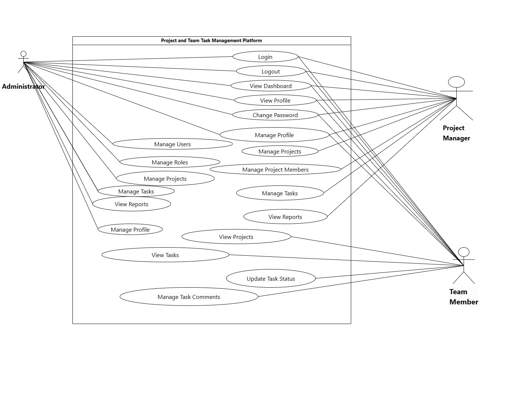

# Diagrams

This folder contains Mermaid diagrams and exported visual diagrams for architecture, database, authentication, and workflow documentation.

## Architecture

- [System Architecture](architecture/system-architecture.md)
- [Folder Architecture](architecture/folder-architecture.md)

## Database

- [Database ER Diagram - Mermaid](database/database-er.md)
- [Database ER Diagram - Image](database/entity-relationship-diagram.jpg)

## Authentication and Sequence Flows

- [Authentication Flow](sequence/authentication-flow.md)
- [Login Sequence](sequence/login-sequence.md)
- [Task Assignment Sequence](sequence/task-assignment-sequence.md)

## Use Cases and Workflows

- [Use Case Diagram - Image](use-cases/use-case-diagram.png)
- [Project Workflow](use-cases/project-workflow.md)
- [Task Lifecycle](use-cases/task-lifecycle.md)

