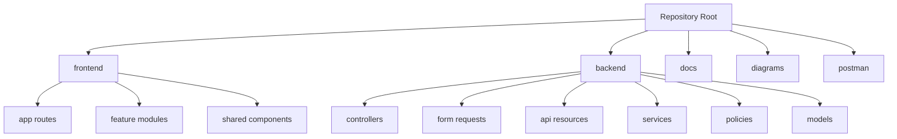

# Folder Architecture

```mermaid
flowchart TD
    Root[Repository Root]
    Root --> Frontend[frontend]
    Root --> Backend[backend]
    Root --> Docs[docs]
    Root --> Diagrams[diagrams]
    Root --> Postman[postman]
    Frontend --> App[app routes]
    Frontend --> Features[feature modules]
    Frontend --> Components[shared components]
    Backend --> Controllers[controllers]
    Backend --> Requests[form requests]
    Backend --> Resources[api resources]
    Backend --> Services[services]
    Backend --> Policies[policies]
    Backend --> Models[models]
```
