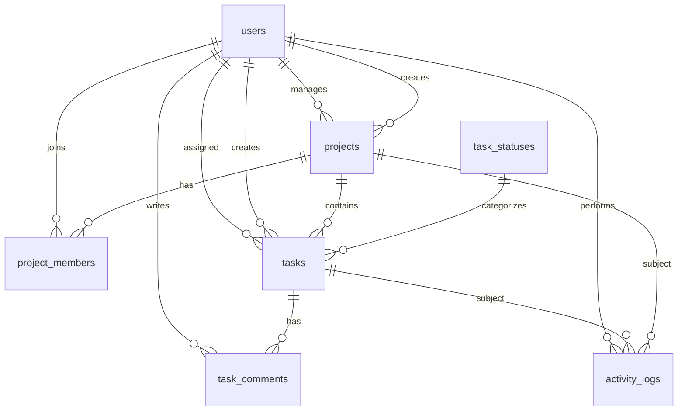

# Database ER Diagram

```mermaid
erDiagram
    users ||--o{ projects : manages
    users ||--o{ projects : creates
    users ||--o{ project_members : joins
    users ||--o{ tasks : assigned
    users ||--o{ tasks : creates
    users ||--o{ task_comments : writes
    users ||--o{ activity_logs : performs
    projects ||--o{ project_members : has
    projects ||--o{ tasks : contains
    task_statuses ||--o{ tasks : categorizes
    tasks ||--o{ task_comments : has
    tasks ||--o{ activity_logs : subject
    projects ||--o{ activity_logs : subject
```
