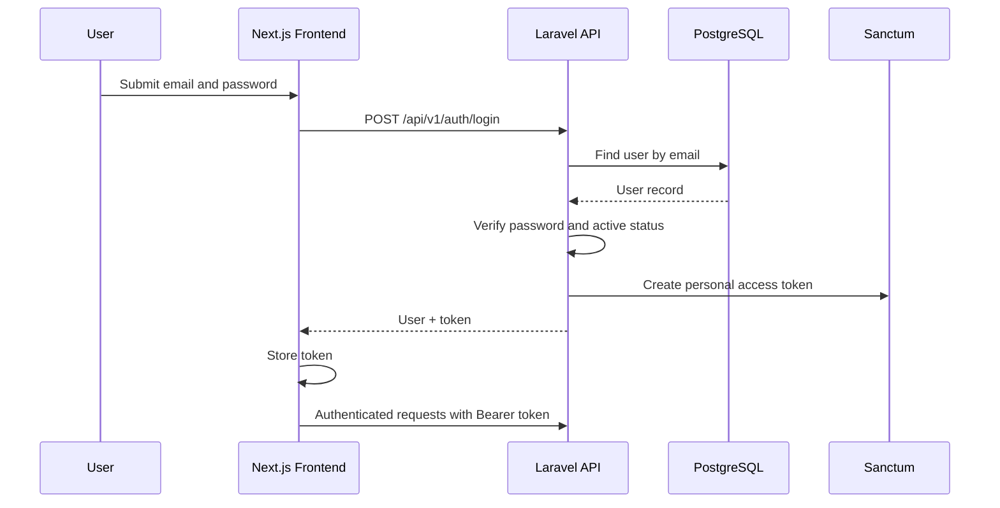

# Authentication Flow

```mermaid
sequenceDiagram
    participant User
    participant UI as Next.js Frontend
    participant API as Laravel API
    participant DB as PostgreSQL
    participant Sanctum

    User->>UI: Submit email and password
    UI->>API: POST /api/v1/auth/login
    API->>DB: Find user by email
    DB-->>API: User record
    API->>API: Verify password and active status
    API->>Sanctum: Create personal access token
    API-->>UI: User + token
    UI->>UI: Store token
    UI->>API: Authenticated requests with Bearer token
```
