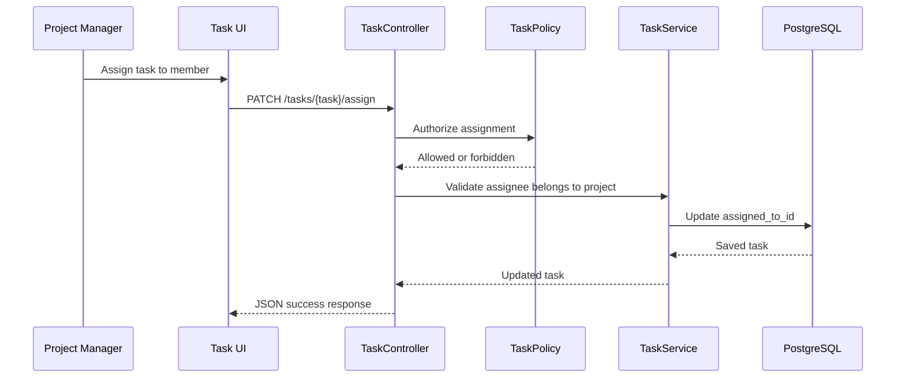

# Task Assignment Sequence

```mermaid
sequenceDiagram
    participant Manager as Project Manager
    participant UI as Task UI
    participant API as TaskController
    participant Policy as TaskPolicy
    participant Service as TaskService
    participant DB as PostgreSQL

    Manager->>UI: Assign task to member
    UI->>API: PATCH /tasks/{task}/assign
    API->>Policy: Authorize assignment
    Policy-->>API: Allowed or forbidden
    API->>Service: Validate assignee belongs to project
    Service->>DB: Update assigned_to_id
    DB-->>Service: Saved task
    Service-->>API: Updated task
    API-->>UI: JSON success response
```
