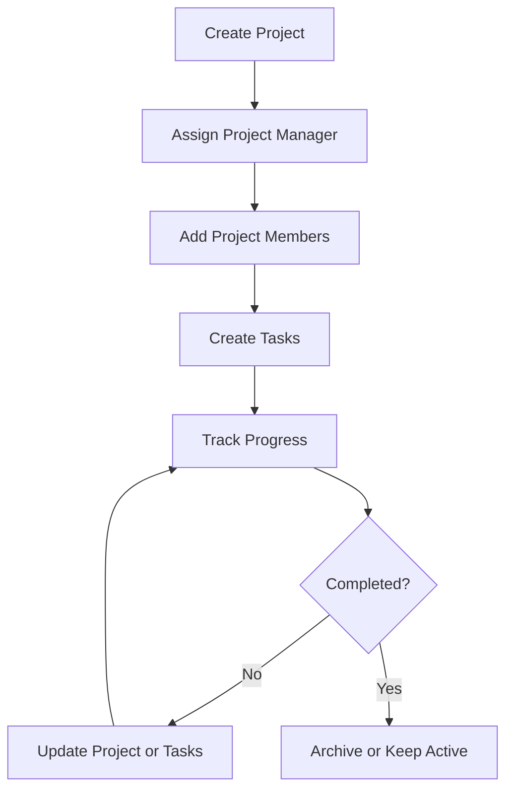

# Project Workflow

```mermaid
flowchart TD
    Create[Create Project] --> AssignManager[Assign Project Manager]
    AssignManager --> AddMembers[Add Project Members]
    AddMembers --> CreateTasks[Create Tasks]
    CreateTasks --> Track[Track Progress]
    Track --> Complete{Completed?}
    Complete -->|No| Update[Update Project or Tasks]
    Update --> Track
    Complete -->|Yes| Archive[Archive or Keep Active]
```
