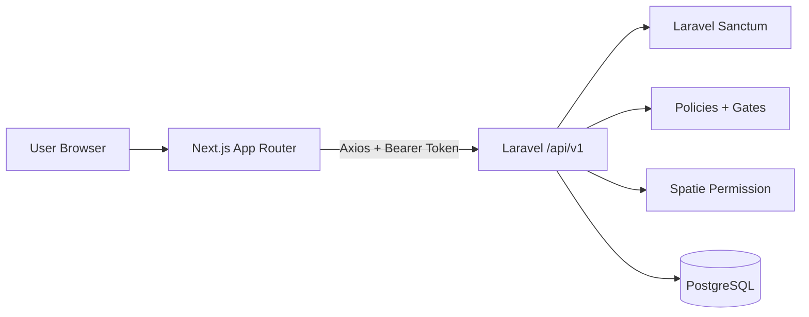

# Architecture

The platform uses a decoupled architecture with a Next.js frontend and Laravel REST API backend. The frontend communicates only through versioned API endpoints. The backend owns persistence, authentication, authorization, validation, and business workflow execution.

## High-Level Flow

## Design Decisions

- Separate frontend and backend applications keep deployment and ownership boundaries clear.
- REST APIs provide a simple assessment-friendly integration contract.
- Laravel services keep controllers thin and business logic testable.
- Policies and permissions are enforced server-side; frontend menu filtering improves UX only.
- PostgreSQL is used for normalized relational data and reliable constraints.
