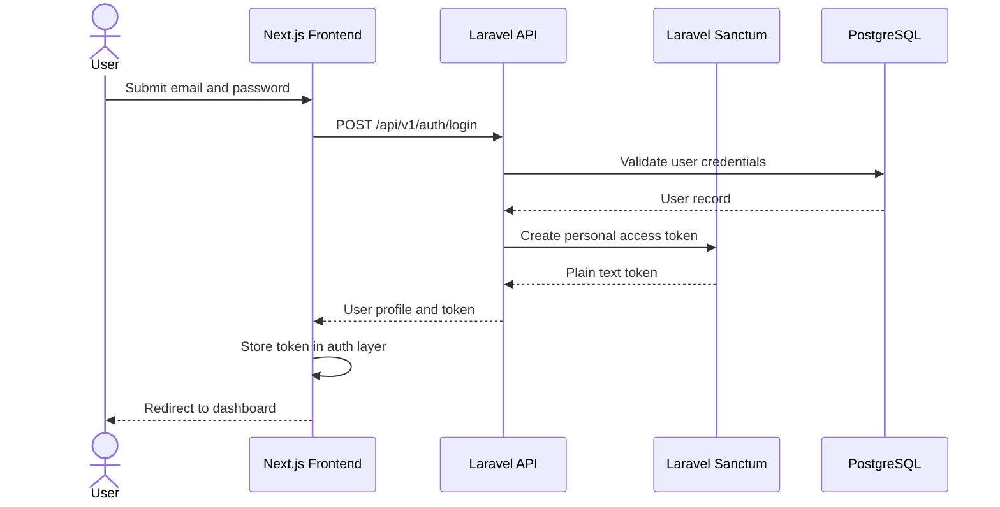
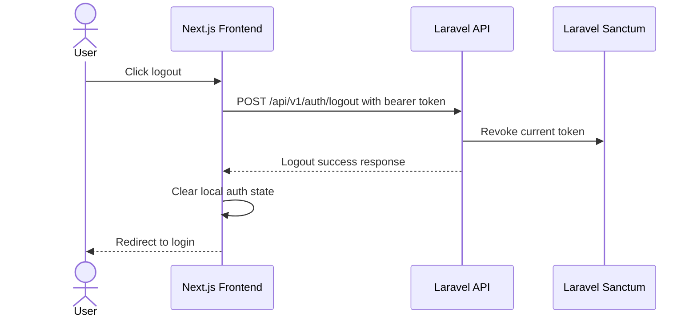

# Authentication and Authorization

## Overview

The platform uses Laravel Sanctum for API authentication and combines Laravel policies with Spatie Laravel Permission for role and permission based authorization.

The frontend authenticates users through the REST API, stores the returned Sanctum token in the existing auth layer, and sends the token with protected API requests.

## Laravel Sanctum

Sanctum issues personal access tokens for API clients. After successful login, the backend creates a token with Laravel's `createToken` method and returns it to the frontend in the login response.

The API uses bearer-token authentication instead of cookie-based SPA authentication for the current frontend integration.

## Bearer Token Authentication

Protected requests must include:

```http
Authorization: Bearer <token>
Accept: application/json
Content-Type: application/json
```

If the token is missing, invalid, or expired, the API returns `401 Unauthorized`.

## Login Flow



## Logout Flow



## Token Storage

The frontend stores the token through the existing authentication layer. The token is used only for API authorization headers and should not be exposed in UI output.

For production deployments, use HTTPS so bearer tokens are never transmitted over plain HTTP.

## Protected Routes

Frontend protected routes verify authentication state before rendering dashboard pages. Unauthenticated users are redirected to `/login`. Authenticated users are redirected away from `/login` to `/dashboard`.

Backend protected routes are grouped under `auth:sanctum` middleware in `routes/api.php`.

## Role-Based Authorization

The system defines these default roles:

- Administrator
- Project Manager
- Team Member

Roles are managed by Spatie Laravel Permission. Administrators can manage users, roles, permissions, projects, and system-level resources. Project Managers can manage authorized projects, project members, and project tasks. Team Members can access assigned projects, assigned tasks, and permitted task comments/status updates.

## Permission Policies

Laravel policies enforce resource-level access. This ensures authorization is checked against both the authenticated user's role/permission set and the specific resource context.

Examples:

- A Project Manager can manage members for projects assigned to them.
- A Team Member can view tasks only within authorized project membership scope.
- A user can edit or delete their own task comment unless Administrator permissions apply.

## Authorization Failure Behavior

- `401 Unauthorized`: user is not authenticated.
- `403 Forbidden`: user is authenticated but lacks permission or policy access.
- `404 Not Found`: resource does not exist or is outside authorized scope.

## Frontend Permission Awareness

The sidebar and protected management screens are aligned with the authenticated user's roles and permissions. This improves usability by hiding modules that the current user should not access, while backend policies remain the source of truth for security.
